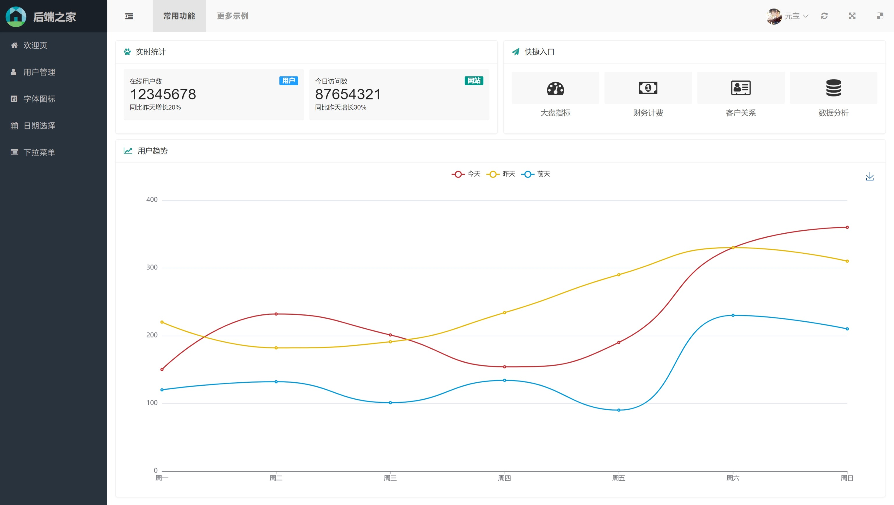

# go-home 简介

- 项目名：后端之家。
- 专为`不太会`前端的`后端开发`准备的后台系统，方便后端开发快速开发后台工具，排查线上问题，节省生命与时间
- 界面采用开源的`Layui`、`LayuiMini`和`GridManager`，极大地简化了项目代码和结构，代码量少所以可快速上手
- 本项目只提供项目框架和工具，具有简单且清晰的代码结构，但没有集成具体的业务功能，适合从零开始的项目

## 项目特点

- 任意IDE或者代码编辑器环境都能直接使用，无需额外安装前端工具
- 你只需要会基础的`html`和`js`以及`css`即可，无须太多的前端知识
- 本项目内置`golang`作为后端，但你可以单独复制`web`目录到其他任何项目中
- 你甚至可以不启动后端直接打开`web`目录中的`index.html`，也能预览大部分页面
- 后端主要使用`gin`和`gorm/gen`框架，实现了基于`jwt`的用户登录流程
- 首创**自由条件组合**，支持任意条件嵌套，专治各种复杂的BI场景

## 界面预览

### 主页面



### 自由条件

- 满足产品及研发任意查询需求，适用于B端后台或OLAP系统
- 图中蓝色框为`且`，黄色框为`或`，所见即所得，无隐藏逻辑

```sql
((`user`.`id` > 3 AND (`user`.`id` < 2 OR `user`.`id` IN (5,6)))
 OR `user`.`name` LIKE "%元宝%") OR (`user`.`gender` = "女" AND `user`.`id` < 3)
```


